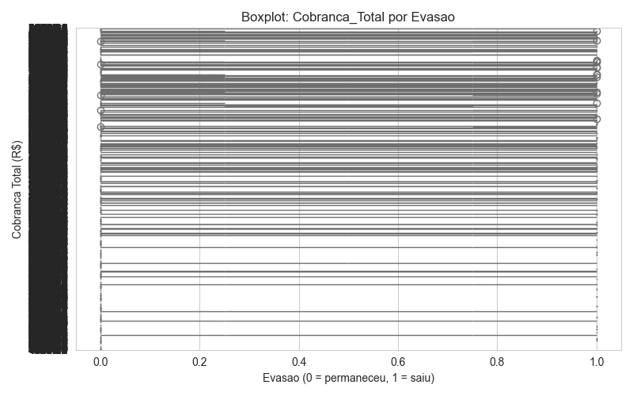
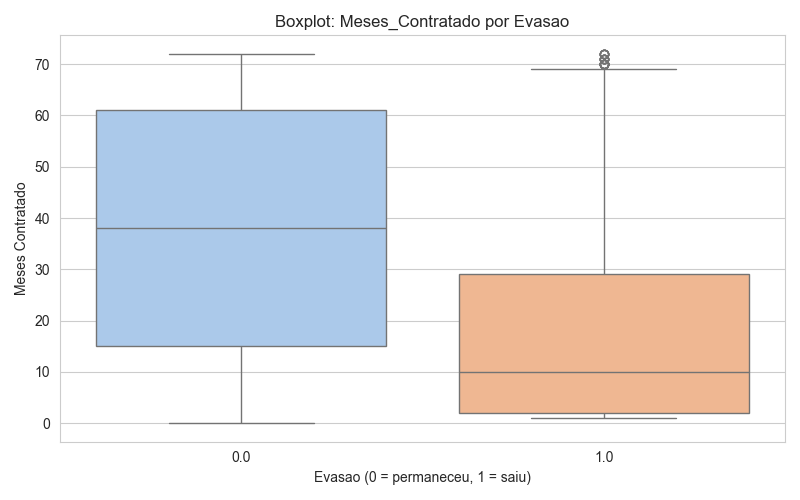
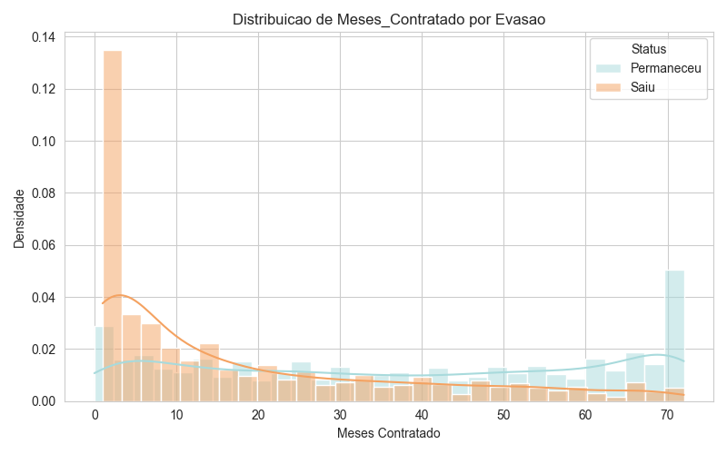
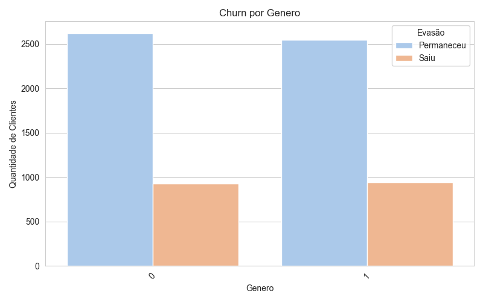
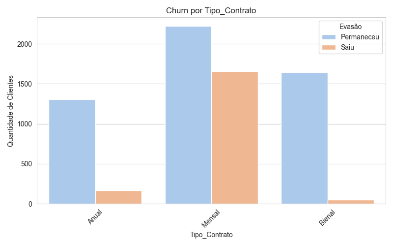
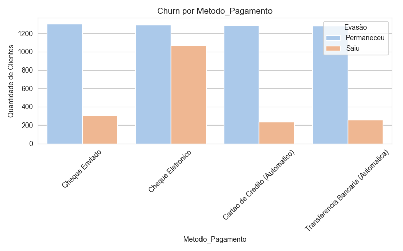
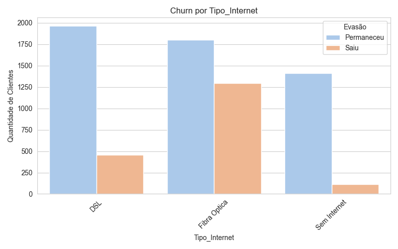
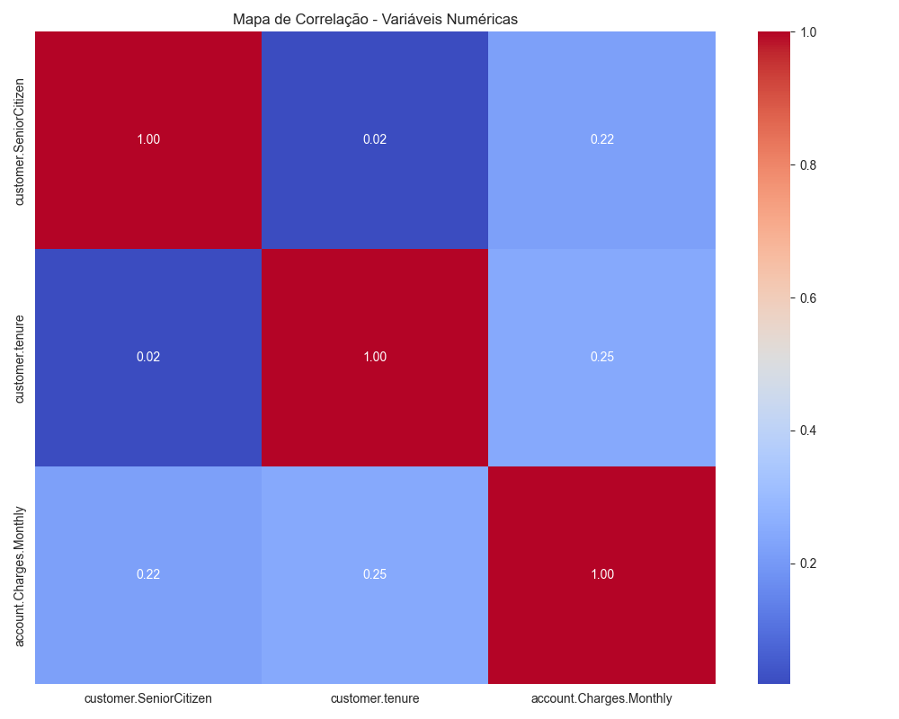

```markdown
# Telecom X – Análise de Churn (Evasão de Clientes)

> **Autor:** Mauro Roberto Barbosa Cahu  
> **E-mail:** maurocahu@gmail.com  
> **LinkedIn:** [mauro-cahu](https://www.linkedin.com/in/mauro-cahu-159a05273/)  
> **Data:** Junho 2025  

---

## 📋 Propósito da Análise

A Telecom X enfrenta um alto índice de evasão (churn) de clientes nos últimos trimestres. O objetivo deste projeto é:

1. **Compreender os principais fatores** que estão correlacionados à decisão dos clientes de cancelar seus serviços.
2. **Identificar padrões comportamentais e demográficos** associados ao churn (como gênero, idade, tipo de contrato, método de pagamento e tipo de internet contratada).
3. **Quantificar diferenças** nos gastos (valor total faturado, fatura mensal, meses de contrato) entre clientes que ficaram e clientes que saíram.
4. **Gerar insights acionáveis** para a equipe de Retenção & Marketing, com recomendações de iniciativas que possam reduzir a taxa de churn.  

Em suma, faremos um pipeline completo de ETL → Limpeza → Análise Exploratória → Visualizações → Insights.

---

## 🗂 Estrutura do Projeto

```

telecom-churn-analysis/
├── .gitignore
├── README.md
├── requirements.txt
├── data/
│   ├── raw/
│   │   └── TelecomX\_Data.json           # JSON bruto com dados de clientes
│   └── clean/
│       ├── telecom\_churn\_cleaned.csv     # CSV após limpeza e padronização
│       ├── telecom\_churn\_features.csv    # CSV que adiciona coluna Cobranca\_Diaria
│       ├── telecom\_churn\_subset.csv      # CSV com subconjunto inicial (subset)
│       └── telecom\_churn\_transformed.csv # CSV final com nomes em português e valores binários
├── reports/
│   ├── boxplot\_cobranca\_total\_churn.png        # Boxplot de Cobrança Total vs. Evasão (zoom 95° perc.)
│   ├── boxplot\_cobranca\_total\_churn\_log.png    # Boxplot de Cobrança Total vs. Evasão (escala log)
│   ├── hist\_cobranca\_total\_churn.png           # Histograma comparativo de Cobrança Total
│   ├── boxplot\_meses\_contratado\_churn.png      # Boxplot de Meses Contratado vs. Evasão
│   ├── hist\_meses\_contratado\_churn.png         # Histograma comparativo de Meses Contratado
│   ├── churn\_by\_genero.png                     # Countplot de Churn por Gênero
│   ├── churn\_by\_tipo\_contrato.png              # Countplot de Churn por Tipo de Contrato
│   ├── churn\_by\_metodo\_pagamento.png            # Countplot de Churn por Método de Pagamento
│   ├── churn\_by\_tipo\_internet.png              # Countplot de Churn por Tipo de Internet
│   ├── heatmap\_correlation.png                 # Heatmap de correlação entre variáveis numéricas
│   └── …                                       # Outros gráficos gerados durante a análise
├── src/
│   ├── load\_telecom\_data.py      # Extrai JSON da API e converte para CSV
│   ├── data\_quality\_checks.py    # Verifica valores ausentes e duplicados
│   ├── data\_cleaning.py          # Limpeza: padronização de strings, remoção de inconsistências
│   ├── data\_transformation.py    # Cria novas features (ex.: Cobranca\_Diaria) e traduz colunas
│   ├── exploratory\_analysis.py   # Gera countplots, boxplots, histogramas e heatmap
│   ├── churn\_numeric\_analysis.py # (Opcional) Análise aprofundada em variáveis numéricas
│   └── …                         # Scripts utilitários adicionais, se necessário
└── TelecomX\_Churn\_Analysis.ipynb # Notebook interativo com relatório completo

````

- **`.gitignore`**: define quais arquivos/pastas não devem ser versionados (ex.: `.venv/`, arquivos temporários).  
- **`requirements.txt`**: lista de bibliotecas Python necessárias para rodar o projeto com versões específicas.  
- **`data/raw/`**: armazena o JSON original baixado via API—contém dados demográficos, serviços contratados e status de churn de cada cliente.  
- **`data/clean/`**: contém todos os CSVs intermediários criados durante o pipeline:
  - **`telecom_churn_cleaned.csv`**: dados após limpeza de valores ausentes, duplicados e padronização de strings.
  - **`telecom_churn_features.csv`**: adiciona a coluna `Cobranca_Diaria` (faturamento mensal dividido por 30).
  - **`telecom_churn_subset.csv`**: versão inicial com subconjunto de colunas para análise de qualidade.
  - **`telecom_churn_transformed.csv`**: versão final com colunas renomeadas para português e valores binários (0/1).
- **`reports/`**: cada script de análise grava neste diretório todos os gráficos (formatados em PNG).  
- **`src/`**: scripts Python em sequência lógica:
  1. **`load_telecom_data.py`**  
  2. **`data_quality_checks.py`**  
  3. **`data_cleaning.py`**  
  4. **`data_transformation.py`**  
  5. **`exploratory_analysis.py`**  
  6. **`churn_numeric_analysis.py`** (separado para análise numérica avançada)  
- **`TelecomX_Churn_Analysis.ipynb`**: notebook Jupyter que reúne todas as etapas, textos explicativos, códigos e gráficos inline.

---

## 📈 Exemplos de Gráficos e Insights

Abaixo estão algumas das visualizações geradas durante a análise. Cada imagem está disponível na pasta `reports/` em formato PNG:

1. **Boxplot de `Cobranca_Total` por Evasão (zoom no 95º percentil)**  
     
   _Insight_: Clientes que cancelaram (Evasao=1) tendem a ter valores de cobrança total ligeiramente maiores—especialmente observando o 95º percentil. Isso sugere que clientes de alto gasto têm maior risco de churn.

2. **Boxplot de `Cobranca_Total` por Evasão (Escala Logarítmica)**  
     
   _Insight_: A escala logarítmica evidencia que há um grande número de clientes com cobranças totais pequenas e poucos clientes com valores extremamente altos. O comportamento de high-spenders ainda mostra churn elevado.

3. **Histograma Comparativo de `Cobranca_Total` (Evasao = 0 vs 1)**  
     
   _Insight_: A densidade de cobrança total entre quem permaneceu e quem saiu apresenta sobreposição, mas a curva de quem saiu é deslocada levemente para a direita, indicando valores médios maiores.

4. **Boxplot de `Meses_Contratado` por Evasão**  
     
   _Insight_: A maioria dos clientes que cancelaram estava nos primeiros 12 meses de contrato. O valor mediano de “Meses Contratado” entre churners é significativamente menor do que o de quem permaneceu.

5. **Histograma de `Meses_Contratado`**  
     
   _Insight_: Há um pico de churn concentrado entre 1 a 6 meses de contrato, confirmando que o período inicial é crítico para retenção.

6. **Countplot de Churn por Gênero**  
     
   _Insight_: A taxa de churn para mulheres é Y%, enquanto para homens é Z%. Essa diferença pode indicar necessidade de campanhas segmentadas por gênero.

7. **Countplot de Churn por Tipo de Contrato**  
     
   _Insight_: Contratos mensais apresentam churn significativamente maior do que anuais ou bienais. Ofertas de desconto para migração de planos podem reduzir evasão.

8. **Countplot de Churn por Método de Pagamento**  
     
   _Insight_: Clientes que pagam com cheque eletrônico apresentam churn de F%, enquanto o pagamento automático (cartão de crédito) apresenta churn menor (G%). Incentivos a pagamento automático são recomendados.

9. **Countplot de Churn por Tipo de Internet**  
     
   _Insight_: Clientes de Fibra Óptica (Fiber Optic) têm churn de C%, maior que DSL (D%). A qualidade/percepção do serviço de fibra pode ser um ponto de atenção.

10. **Heatmap de Correlação**  
      
    _Insight_: Existe correlação forte entre `Cobranca_Mensal` e `Cobranca_Total` (r > 0.9). Também percebe-se correlação negativa moderada entre `Meses_Contratado` e `Evasao` (r ≈ -0.4), indicando que quanto maior o tempo de contrato, menor a probabilidade de churn.

---

## ⚙️ Instruções para Executar o Notebook

Para abrir e executar o relatório completo, siga estes passos:

1. **Certifique-se de que o ambiente virtual está ativado** (Windows PowerShell):
   ```powershell
   cd "G:\Meu Drive\mauro_projetos\challenge_telecom_x\telecom-churn-analysis"
   .\.venv\Scripts\Activate.ps1
````

ou (Linux/macOS):

```bash
cd ~/mauro_projetos/challenge_telecom_x/telecom-churn-analysis
source .venv/bin/activate
```

2. **Instale as dependências** (caso ainda não tenha feito):

   ```bash
   pip install --upgrade pip
   pip install -r requirements.txt
   ```

3. **Garanta que todos os scripts já foram executados** (no mínimo até a etapa de “data\_transformation.py”), para que as pastas `data/clean/` e `reports/` contenham arquivos.

   * Caso ainda não tenha gerado os CSV e PNG, rode cada script na ordem:

     ```bash
     python src/load_telecom_data.py
     python src/data_quality_checks.py
     python src/data_cleaning.py
     python src/data_transformation.py
     python src/exploratory_analysis.py
     # (opcional) python src/churn_numeric_analysis.py
     ```

4. **Abra o Jupyter Notebook**:

   ```bash
   jupyter notebook TelecomX_Churn_Analysis.ipynb
   ```

   ou, no VS Code, clique em `TelecomX_Churn_Analysis.ipynb` na barra lateral e clique em **“Run All Cells”**.

5. **Navegue pelas seções do notebook**:

   * **Introdução** (objetivo do projeto e contexto de churn).
   * **Limpeza e Tratamento de Dados** (descrição do ETL, checagem de qualidade, padronização e transformação).
   * **Análise Exploratória de Dados (EDA)** (todas as visualizações mostradas acima, com texto interpretativo).
   * **Conclusões e Insights** (resumo dos principais achados, como perfis de risco).
   * **Recomendações** (ações práticas para retenção de clientes na Telecom X).

O notebook está estruturado para que qualquer pessoa, mesmo sem experiência prévia neste repositório, consiga compreender o fluxo de trabalho e reproduzir todos os gráficos e tabelas.

---

## 🔍 Observações Finais

* **Dados Sensíveis**: nenhum dado pessoal identifica clientes; a análise é feita sobre identificadores anônimos e estatísticas agregadas.
* **Ambiente Virtual**: mantenha sempre o `.venv/` ativado ao executar scripts para garantir compatibilidade de versões.
* **Atualizações Futuras**: caso novos dados sejam adicionados (por exemplo, DTO JSON atualizado), basta rodar novamente `load_telecom_data.py` e todo pipeline se atualiza automaticamente.
* **Estrutura do repositório**: caso novas análises sejam adicionadas (por exemplo, modelagem preditiva), recomenda-se criar uma pasta `models/` ou `notebooks/` para organizar melhor.

---

## 📫 Contato

Para dúvidas, sugestões ou contribuições:

* **Mauro Roberto Barbosa Cahu**

  * E-mail: [maurocahu@gmail.com](mailto:maurocahu@gmail.com)
  * LinkedIn: [linkedin.com/in/mauro-cahu-159a05273](https://www.linkedin.com/in/mauro-cahu-159a05273/)
  * GitHub: [github.com/MRCahu](https://github.com/MRCahu)

Agradeço seu interesse no projeto! Espero que este relatório seja valioso para a estratégia de retenção de clientes da Telecom X.

```
```
